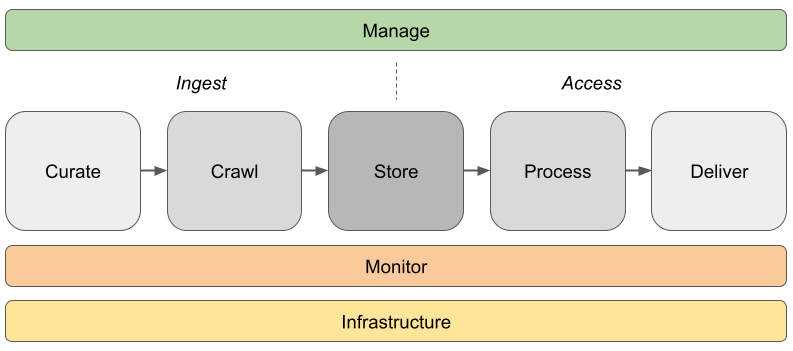

# ukwa-services <!-- omit in toc -->

Deployment configuration for almost all UKWA services.

## Contents <!-- omit in toc -->

<!-- use the VS Code extension 'Markdown All In One' to keep this table up to date -->

- [Introduction](#introduction)
- [Service Stacks](#service-stacks)
- [High-Level Technical Architecture](#high-level-technical-architecture)
  - [Overview](#overview)
  - [Areas](#areas)
    - [Manage](#manage)
    - [Ingest](#ingest)
    - [Storage](#storage)
    - [Process](#process)
    - [Access](#access)
    - [Monitoring](#monitoring)
  - [Interfaces](#interfaces)
  - [Networks](#networks)
- [Software](#software)
  - [Deployment Process](#deployment-process)

## Introduction

These [Docker Stack](https://docs.docker.com/engine/reference/commandline/stack/) configurations and related scripts are used to launch and manage our main services.  No internal or sensitive data is kept here -- that is stored in internal `ukwa-services-env` repository as environment variable scripts required for deployment, or as part of the CI/CD system.

Note that some services are not deployed via containers, e.g. the Hadoop clusters, and the Solr and OutbackCDX indexes.  Those are documented elsewhere, but the interaction with those other services will be made clear.

## Service Stacks

Service stacks are grouped by broad service area, e.g. [`access`](./access) contains the stacks that provides the access services, and the [access README](./access/README.md) provides detailed documentation on how the access services are deployed. The service areas are:

- [`ingest`](./ingest) covers all services relating to the curation and ingest of web archives
- [`access`](./access) covers all services relating to how we make the web archives accessible to our audiences 
- [`manage`](./manage) covers all internal services relating to the management of the web archive, including automation and workflows that orchestrate activities from ingest to storage and then to access

_For a high-level overview of how these service stacks interact, see the [section on technical architecture below](#high-level-technical-architecture)._

Within each sub-folder, e.g. `access/website`, we have a  `docker-compose.yml` file which should be used for all deployment contexts (e.g. `dev`,`beta` and `prod`). Any necessary variations should be defined via environment variables.

These variables, any other context-specific configuration, should be held in subdirectories. For example, if `access/website/docker-compose.yml` is the main stack definition file, any addtional services needed only on `dev` might be declared in `access/website/dev/docker-compose.yml` and would be deployed separately.

The process for updating and deploying components is described in [the deployment section below](#deployment-process).

## High-Level Technical Architecture

This is a high-level introduction to the technical components that make up our web archiving services. The primary purpose of this documentation to try and ensure the whole team have an overview of the whole system, and can work out which components are involved when something goes wrong.

Some wider contextual information can be found at:

*   [http://data.webarchive.org.uk/ukwa-documentation/how-ukwa-works/\_index.html](http://data.webarchive.org.uk/ukwa-documentation/how-ukwa-works/_index.html) (source [https://github.com/ukwa/ukwa-documentation/tree/master/content/how-ukwa-works](https://github.com/ukwa/ukwa-documentation/tree/master/content/how-ukwa-works))
*   ...TBA...

Note that the images on this page can be found at:

*   [This Google Slides presentation.](https://docs.google.com/presentation/d/1MnJfldL7MvJYJ28genZqjmDoHhOlo8dRNqmuZGqa5fc/edit?usp=sharing)
*   ...TBA...

### Overview

The life-cycle of our web archives can be broken down into five main stages, along with management and monitoring processes covering the whole process. Each stage is defined by it's interfaces, with the data standards and protocols that define what goes in to and out of that stage ([see below for more details](#interfaces)). This allows each stage to evolve independently, as long as it's 'contract' with the other stages is maintained.

There are multiple ingest streams, covering different aspects of a single overall workflow, starting with the curation tools that we use to drive the web crawlers. Those harvesting processes pull resources off the web and store them in archival form, to be transferred on HDFS. From there, we can ingest the content into other long-term stores, and can then be used to provide access to individual resources both internally and externally, for all the Legal Deposit libraries. As the system complexities and service levels vary significantly across the different access channels, we identify them as distinct services, while only have one (unified) harvesting service.

In order to be able to find items of interest among the billions of resources we hold, we run a range of data-mining processes on our collections that generate appropriate metadata, which is then combine with manually-generated annotations (supplied by our curators) and used to build our catalogue records and indexes. These records drive the discovery process, allowing users to find content which can then be displayed over the open web or via the reading room access service (as appropriate).

### Areas

#### Manage

The critical management component is Apache Airflow, which orchestrates almost all web archive activity. For staff, it is accessible at [http://airflow.api.wa.bl.uk](http://airflow.api.wa.bl.uk). Each workflow (or DAG in Airflow terminology) is accessible via the management interface, and the description supplied with each one provides documentation on what the task does. Where possible, each individual task in a workflow involves running a command-line application wrapped in versioned Docker container. Developing our tools as individual command-line applications is intended to make them easier to maintain. The Airflow deployment and workflows are defined in the `./manage` folder, in [./manage/airflow](./manage/airflow)

Another important component is `TrackDB`, which contains a list of all the files on our storage systems, and it used by Airflow tasks to keep track of what's been indexed, etc.

See [`manage`](./manage/) for more details.

#### Ingest

Covers curation services and crawl services, everything leading to WARCs and logs to store, and metadata for access.

See [`ingest`](./ingest/) for more details.

#### Storage

Storage systems are not deployed as containers, so there are no details here.  We currently have multiple Hadoop clusters, and many of the tasks and components here rely on interacting with those clusters through their normal APIs.

#### Process

There are various Airflow tasks that process the data from W3ACT or from the Hadoop storage. We use the Python MrJob library to run tasks, which are defined in the `ukwa/ukwa-manage` repository. That is quite a complex system, as it supports Hadoop 0.20.x and Hadoop 3.x, and supports tasks written in Java and Python. See [`ukwa/ukwa-manage`](https://github.com/ukwa/ukwa-manage) for more information.

#### Access

Our two main access services are:

* The _UK Web Archive_ open access service, online at https://www.webarchive.org.uk/
* The _Legal Deposit Access Service_, only available in Legal Depost Library reading rooms.

See [`access`](./access/) for more details.

#### Monitoring

Runs independently of all other systems, on separate dedicated hardware. Uses the Prometheus stack with alerts defined for major critical processes. See [https://github.com/ukwa/ukwa-monitor](https://github.com/ukwa/ukwa-monitor) for detail.

### Interfaces

| Interface | Protocol | Further Details |
| --------- | -------- | --------------- |
| Curate > Crawl | Crawl feeds (seeds, frequencies, etc.), NEVER-CRAWL list. | Generated from W3ACT, see the [w3act\_export workflow](http://airflow.api.wa.bl.uk/dags/w3act_export/grid). |
| Crawl > Storage | WARC/WACZ files and logs. | These are stored locally then moved to HDFS using Cron jobs (FC) and Airflow (DC, see [copy\_to\_hdfs\_crawler08](http://airflow.api.wa.bl.uk/dags/copy_to_hdfs_crawler08/grid)). | See the [HDFS layout](HDFS-file-system-layout-and-content_154765461.html) page which describes how we expect content to be layed out so it's provenance and nature are clear. |
| Storage > Process | WARC/WACZ files and logs, Metadata from W3ACT exports. | This covers indexing tasks like CDX generation, full-text indexing etc. |
| Process > Access |  WARCs/WACZ on HDFS via HTTP API + TrackDB. OutbackCDX API. Solr Full-text and Collections APIs. Data exported by w3act\_export (allows.aclj, blocks.aclj) | As the collection is large, access is powered by APIs rather than file-level standards.| 

### Networks

The systems configured or maintained by the web archiving technical team are located on the following networks.

| Network Name | IP Range | Description |
| ------------ | -------- | ----------- |
| WA Public Network| 194.66.232.82 to .94 |All public services and crawlers. Note that the crawlers require unrestricted access to the open web, and so outgoing connections on any port are allowed from this network without going through the web proxy. However, very few incoming connections are allowed, each corresponding to a curatorial or access service component. These restrictions are implemented by the corporate firewall.
| WA Internal Network | - | Internal service component network. Service components are held here to keep them off the public network, but provide various back-end services for our public network and for systems held on other internal networks. This means the components that act as integration points with other service teams are held here.
| WA Private Network | - | The private network's primary role is to isolate the Hadoop cluster and HDFS from the rest of the networks, providing dedicated network capacity for cluster processes without affecting the wider network.
| DLS Access Network | - | The BSP, LDN, NLW and NLW Access VLANs. Although we are not responsible for these network areas, we also deploy service components onto specific machines within the DLS access infrastructure, as part of the _Legal Deposit Access Service_. |

## Software

Almost our entire stack is open source, and the most critical components are co-maintained with other IIPC members. Specifically, the Heritrix crawler and the PyWB playback components (along with the standards and practices that they depend upon, like [WARC](http://iipc.github.io/warc-specifications/)) are crucial to the work of all the IIPC members, and to maintaining access to this content over the long term.

Current upgrade work in progress:

*   Reading Room access currently depends on OpenWayback but should be replaced with a modernized PyWB service through the [TP0012 Legal Deposit Access Solution](https://wiki.bl.uk:8443/display/WAG/TP0012+Legal+Deposit+Access+Solution) project.
*   Adoption of Browsertrix Cloud for one-off crawls, with the intent to move all Frequent Crawls into it eventually.
*   A new approach is needed to manage monitoring and replication of content across H020, H3 BSP and H3 NLS.
*   Full-scale fulltext indexing remains a challenge and new workflows are needed.
*   All servers and containers need forward migration to e.g. to the latest version of RedHat, dependent libraries etc. As we have a fairly large estate, this is an ongoing task. Generally, this can be done without major downtime, e.g. using Hadoop means it's relatively straightforward to take a storage node out and upgrade its operating system without interrupting the service. 

### Deployment Process

First, individual components should be developed and tested on developers' own machines/VMs, using the [Docker Compose](https://docs.docker.com/compose/compose-file/) files within each tool's repository. e.g. [w3act](https://github.com/ukwa/w3act/blob/master/docker-compose.yml).

These are are intended to be self-contained. i.e. if possible should not depend on external services, but use dummy ones populated with test data.

Once a new version of a component is close to completion, we will want to run then against internal APIs for integration testing and/or user acceptance testing, and that's what the files in this repository are for. A copy of this repository is available on the shared storage of the DEV Swarm, and that's where new builds of versions of containers should be tested.

Once we're happy with the set of Swarm stacks, we can tag the whole configuration set for release through BETA and then to PROD.

Whoever is performing the roll-out will then review the tagged `ukwa-services` configuration:

- check they understand what has been changed, which should be indicated in the relevant pull request(s) or commit(s)
- review setup, especially the prod/beta/dev-specific configurations, and check they are up to date and sensible
- check no sensitive data or secrets have crept into this repository (rather than `ukwa-services-env`)
- check all containers specify a tagged version to deploy
- check the right API endpoints are in us
- run any tests supplied for the component

  
