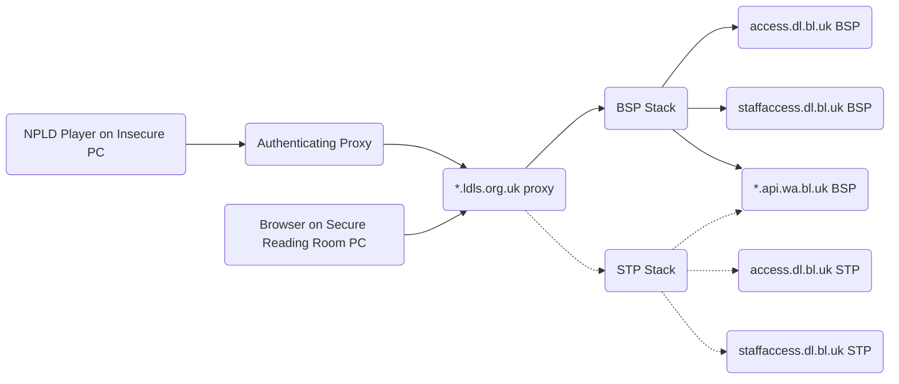

Reading Room Wayback Service Stack
==================================

This [Docker Swarm Stack](https://docs.docker.com/engine/swarm/key-concepts/) deploys the back-end services required to provide reading-room and staff access to Non-Print Legal Deposit material.

This system provides a web-based access point for every Legal Deposit library, and one more for BL Staff, through which NPLD material can be accessed.  This covers items delivered to us by publishers (supporting eBook and ePub formats at this time), and web pages captured by the UK Web Archive. This system implements the access restrictions required by the NPLD regulations.

This replaces the remote-desktop-based access system by using [UK Web Archive Python Wayback](https://github.com/ukwa/ukwa-pywb) (UKWA PyWB) to provide access to content directly to secure browsers in reading rooms (either directly, or via the forthcoming [NPLD Player](https://github.com/ukwa/npld-player)). The UKWA PyWB system also implements the Single-Concurrent Usage (SCU) locks, and provides a way for staff to manage those locks if needed.

To Do
-----

This section has been moved to: https://github.com/ukwa/ukwa-services/issues/69

Overview
--------

To ensure a smooth transition, this service maintains the same pattern of URLs for accessing content as the current system. e.g.

- https://blstaff.ldls.org.uk/welcome.html?ark:/81055/vdc_100090432161.0x000001
- http://bodleian.ldls.org.uk/ark:/81055/vdc_100090432161.0x000001
- https://bl.ldls.org.uk/welcome.html?10000101000000/http://www.downstairsatthekingshead.com
- https://nls.ldls.org.uk/10000101000000/http://www.downstairsatthekingshead.com _TBC: Is this syntax supported? i.e. no `welcome.html`?_

The items with ARK identifiers are handled by the PyWB `live` collection that proxies the request downstream to the digital library access service, and the `TIMESTAMP/URL` identifiers are passed to a second `archive` collection that 'replays' the archived web pages back using UKWA internal services. NGINX is used to perform the mappings from expected URLs to those supported by PyWB.

For example, if a BL Reading Room patron uses this Access URL to get an URL from the web archive:

- https://blstaff.ldls.org.uk/welcome.html?10000101000000/http://www.downstairsatthekingshead.com

Then the URL will get mapped to this PyWB URL:

- https://blstaff.ldls.org.uk/web/10000101000000/http://www.downstairsatthekingshead.com

Alternatively, if a BL Staff Access URL used to get an eBook from DLS:

- https://blstaff.ldls.org.uk/welcome.html?ark:/81055/vdc_100090432161.0x000001

Then the content will be served from this URL:

- https://blstaff.ldls.org.uk/doc/20010101120000/http://staffaccess.dl.bl.uk/ark:/81055/vdc_100090432161.0x000001

In this case, a fixed timestamp is used for all ARKs and the `http://staffaccess.dl.bl.uk` prefix has been added, as PyWB needs both a timestamp and a URL to get the content and manage the SCU locks. Requests from reading rooms would be directed to `http://access.dl.bl.uk`, e.g. http://access.dl.bl.uk/ark:/81055/vdc_100022588767.0x000002

### Deployment Architecture

It is expected that the services in this stack are used as the back-end for an upstream proxy.  For example, for the British Library, there is some frontend proxy that the `bl.ldls.org.uk` domain name resolves to. That 'front door' proxy will then pass the request on to the relevant back-end services provided by this service stack, which will be deployed in BSP and STP, and connected up using the existing failover mechanism. This backend system can be used directly from secure reading room PCs, or using the NPLD Player on unsecured reading room PCs.  Note that the back-end setup is the same in either case, as the access restrictions are implemented at the network level, and the NPLD Player authentication is handled upstream.



Note that the web archive is only accessible via the BSP site at present, so will become unavailable if BSP is down and all content is being served via STP. Access to NPLD douments should work fine, as the `*.dl.bl.uk` services are available at both sites.

To support this mode of operation, this stack runs the following set of services:

- An NGINX service to provide URL management, with a shared port and separate ports for each service.
- Seven PyWB services, one for each Legal Deposit Library (BL/NLW/NLS/Bod/CUL/TCD managing SCU locks for each), and one for staff access (no SCU locks).
- A Redis service, which holds the SCU lock state for all the PyWB services.

Each service supports two host names, the real `*.ldls.org.uk` name and a `*.beta.ldls.org.uk` version that could be used if it is necessary to test this system in parallel with the original system.  When accessed over the shared port, NGINX uses the `Host` in the request to determine which service is being called. Each PyWB service also exposes a dedicated port, but this is intended to debugging rather than production use.


| Server Name           | Beta Server Name            | Shared NGINX Port | Dedicated NGINX Port | Direct PyWB Port (for debugging) |
|-----------------------|-----------------------------|-------------------|----------------------|----------------------------------|
| bl.ldls.org.uk        | bl.beta.ldls.org.uk         | 8100              | 8200                 | 8300                             |
| nls.ldls.org.uk	      | nls.beta.ldls.org.uk        | 8100              | 8201                 | 8301                             |
| llgc.ldls.org.uk      | llgc.beta.ldls.org.uk       | 8100              | 8202                 | 8302                             |
| cam.ldls.org.uk       | cam.beta.ldls.org.uk        | 8100              | 8203                 | 8303                             |
| bodleian.ldls.org.uk  | bodleian.beta.ldls.org.uk   | 8100              | 8204                 | 8304                             |
| tcdlibrary.ldls.org.uk| tcdlibrary.beta.ldls.org.uk | 8100              | 8205                 | 8305                             |
| blstaff.ldls.org.uk   | blstaff.beta.ldls.org.uk    | 8100              | 8209                 | 8309                             |


This NGINX setup assumes that any failover redirection, SSL encryption, authentication, token validation or user identification has all been handled upstream of this service stack. 

For testing purposes, a local `/etc/hosts` file can be used to point the `*.ldls.org.uk` domain names to the service stack, allowing the service to be viewed in a web browser. Of course this won't include any of the services that are handled upstream.

Pre-requisites
--------------

In each deployment location:

- One or more Linux servers with Docker installed and running in Swarm mode.
- Network access to:
    - The public web, if only temporarily, install these files and to download the Docker images during installation/deployment.
        - If this is not possible [offline Docker image installation can be used](https://serverfault.com/a/718470).
    - The BL internal nameservers, so `\*.api.wa.bl.uk` service domains can be resolved.
    - The DLS back-end systems where ARK-based resources can be downloaded (e.g. `access.dl.bl.uk`, `staffaccess.dl.bl.uk`).
    - The UKWA back-end systems: 
        - CDX index for URL lookups (`cdx.api.wa.bl.uk`).
        - WARC record retrieval (`warc-server.api.wa.bl.uk`).
        - GitLab where the URL block list is stored ([`git.wa.bl.uk`](http://git.wa.bl.uk/bl-services/wayback_excludes_update/-/tree/master/ldukwa/acl)).
        - If deployed on the Access VLAN, the existing UKWA service proxy can be used to reach these systems.


Operations
----------

When running operations on the server, the operator shoudl use a non-root user account that is able to use Docker (i.e. a member of the `docker` group on the machine). e.g.

```
[root@demo ~]# useradd -G docker access
[root@demo ~]# su - access
[access@demo ~]$ docker run hello-world
```

### Deploying and Updating the Stack

First get the `ukwa-services` repository and change to the relevant directory:

```
 git clone https://github.com/ukwa/ukwa-services.git
 cd ukwa-services/access/rrwb
 ```

The Swarm deployment needs access to an host drive location where the list of blocked URLs is stored.  The `deploy-rrwb-dev.sh` script shows an example of how this is done for the UKWA DEV system:  

```
#!/bin/sh

# Where to store shared files:
export STORAGE_PATH_SHARED=/mnt/nfs/data/airflow/data_exports

# Username and password to use to access the locks pages:
export LOCKS_AUTH=demouser:demopass

# Which version of PyWB to use:
export PYWB_IMAGE=ukwa/ukwa-pywb:2.6.4

# Deploy as a Docker Stack
docker stack deploy -c docker-compose.yml access_rrwb
```

A similar deployment script should be created for each deployment context, setting the `STORAGE_PATH_SHARED` environment variable before deploying the stack, and setting the `LOCKS_AUTH` username and password as required.

Before running the deployment script, a copy of the URL block access control list should be placed in your shared folder, as per the [Updating the Blocks List section below](#updating-the-block-list).  Once that's in place, you can run your script to deploy the services.

Assuming the required Docker images can be downloaded (or have already been installed offline/manually), the services should start up and start to come online. In a few moments, you should see:

```
[access@demo rrwb]$ docker service ls
ID             NAME                     MODE         REPLICAS   IMAGE                  PORTS
8de1fqo812x2   access_rrwb_nginx        replicated   1/1        nginx:1-alpine         *:8100->8100/tcp, *:8200-8205->8200-8205/tcp, *:8209->8209/tcp
0nrr4jvzo1z5   access_rrwb_pywb-bl      replicated   1/1        ukwa/ukwa-pywb:2.6.4   *:8300->8080/tcp
oce47sczlkbi   access_rrwb_pywb-bod     replicated   1/1        ukwa/ukwa-pywb:2.6.4   *:8304->8080/tcp
pbhou0zmso6f   access_rrwb_pywb-cam     replicated   1/1        ukwa/ukwa-pywb:2.6.4   *:8303->8080/tcp
a1ixwrebslj0   access_rrwb_pywb-llgc    replicated   1/1        ukwa/ukwa-pywb:2.6.4   *:8302->8080/tcp
oczh6d2c4oh8   access_rrwb_pywb-nls     replicated   1/1        ukwa/ukwa-pywb:2.6.4   *:8301->8080/tcp
lddlkbb80ez7   access_rrwb_pywb-staff   replicated   1/1        ukwa/ukwa-pywb:2.6.4   *:8309->8080/tcp
9s1wyzmlshx0   access_rrwb_pywb-tcd     replicated   1/1        ukwa/ukwa-pywb:2.6.4   *:8305->8080/tcp
e54xnbxkkk14   access_rrwb_redis        replicated   1/1        redis:6
```

Where all service replicas are `1/1`. If any are stuck at `0/1` then they are having trouble starting, and you can use commands like `docker service ps --no-trunc access_rrwb_nginx` to check on individual services.

If the `docker-compose.yml` file is updated, the stack can be redeployed in order to update the Swarm configuration. However, note that most of the specific configuration is in files held on disk, e.g. the NGINX configuration files. If these are changed, the services can be restarted, forcing the configuration to be reloaded, e.g.

    docker service update --force access_rrwb_nginx
    
In case things seem to get into a confused state, it is possible to completely remove the whole service stack and then redeploy it, e.g.

```bash
docker stack rm access_rrwb
# Wait a couple of minutes while everything gets tidied up, then 
./deploy-rrwb-dev.sh
```

### Updating the Block List

The list of URLs that are blocked from access in the Reading Rooms needs to be installed when deploying the service, and will need to be updated periodically (when the web archive team receives take-down requests).

The blocks list is version controlled and held in: http://git.wa.bl.uk/bl-services/wayback_excludes_update/-/tree/master/ldukwa/acl

It needs to be downloaded from there on a regular basis. e.g. a daily cron job like:

    curl -o /shared-folder/blocks.aclj http://git.wa.bl.uk/bl-services/wayback_excludes_update/-/raw/master/ldukwa/acl/blocks.aclj

### Inspecting and Managing SCU locks

The UKWA PyWB system includes [an improved version of the SCU locking mechanism](https://github.com/ukwa/ukwa-pywb/blob/master/docs/locks.md#single-concurrent-lock-system).  When an item is first retrieved, a lock for that item is minted against a session cookie in the secure browser. This initial lock is stored in Redis and set to expire at the end of the day.

However, while the item is being access, a JavaScript client is used to update the lock status, and changes the expiration of the lock to be five minutes in the future. This lock is refreshed every minute or so, so keeps being pushed back into the future while the item is in use. Once the item is no longer being used, the lock updates stop, and the lock is released shortly afterwards. This mechanism is expected to release item locks more reliably than the previous approach.

See [the Admin Page documentation](https://github.com/ukwa/ukwa-pywb/blob/master/docs/locks.md#admin-page-and-api) to see how to access and manage the SCU locks.

Access to this page is managed by HTTP Basic authentication via the `LOCKS_AUTH=username:pw` environment variable that must be set on launch.


### Testing

e.g. 

- http://host:8209/web/19950418155600/http://portico.bl.uk/
- http://host:8209/doc/20010101120000/http://staffaccess.dl.bl.uk/ark:/81055/vdc_100090432161.0x000001

_...TBA..._
