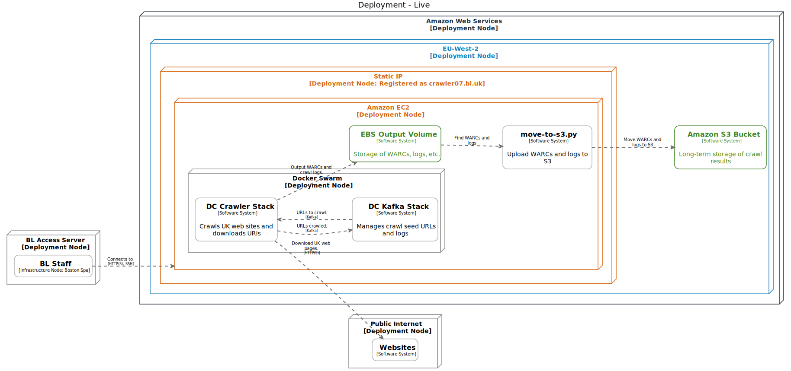

# Setting up a AWS Cloud server for the Domain Crawl

This current approach to the domain crawl on the cloud runs in a very similar way to running on site. The biggest difference is that rather than having a large machine with large disks from the outset, we manage costs and scale by starting with a small EC2 machine with small EBS volumes, and then allow each to grow over time. For example, for DC 2020 we used this sequence of EC2 instances:

- t3.2xlarge (32GB, 8vcpus, 5Gbps) 
- m5.4xlarge (64GB, 16vcpus, up to 10Gbps)
- m5.8xlarge (128GB, 32vcpus, 10Gbps)

This progression was based on memory usage. At scale, Heritrix3 requires larger and larger amounts of memory as the crawl state grows in size.  When it starts to struggle, e.g. hanging for long periods while garbage collection takes place, it's time to move to an instance with more RAM.

To avoid any unexpected variation between EC2 instance types, we will stay within the `m5` family in the future, e.g. kicking off using an `m5.2xlarge` instance (32GB, 8vcpus, up to 10Gbps).

## Overall Architecture

The overall AWS deployment architecture looks like this (although note that for clarity, only the storage drive dedicated to crawler output is shown, see below for more details):

## Storage Drives

For the disk volumes attached to the drive, they need to be set up so that they can be grown over time.  For smaller volumes, we can just make the EBS volumes larger and grow the `ext4` filesystems to make use of the space. However, the state folder needs to be able to grow very large, perhaps 100TB in size. Therefore,  as EBS volumes cannot be larger than 16TiB, we need to combine multiple EBS chunks into a single logical volume.  For this reason, we use LVM and XFS for the state folder, as we are comforable managing large volumes using those tools. 

| Mount point          | Initial Size  | Type  | Description   |
| -------------------- | ----- | ----- | ------------- |
| `/ukwa`              | 500GB | `gp2` | To store all configuration information and helper scripts etc. |
| `/heritrix/scratch`  | 500GB | `gp2` | Scratch space used by Heritrix when downloading files. |
| `/opt/data/cdx`      | 500GB | `io1` | Fast disk (at 3000 IOPS) for the OutbackCDX index of what's been crawled.  Scaling to 1TB+ as needed. |
| `/heritrix/kafka`    | 1TB   | `st1` | Disks for storing Kafka logs (append-only data files). Scaling to 4TB+ as needed. |
| `/heritrix/output`   | 5TB   | `st1` | Disks for storing crawler output (append-only data files). |
| `/heritrix/state `   | 5TB   | `gp2` | Reasonably fast disk for storing crawler state. Scaling up in 5TB chunks as needed. |
| `/var/lib/docker`    | 256GB | `gp2` | Reasonably fast disk for storing the Docker container state and logs. |

Note that for `gp2` SSD storage, the available IOPS is related to the volume site (see [the AWS docs](https://docs.aws.amazon.com/AWSEC2/latest/UserGuide/ebs-volume-types.html)). As the CDX service needs fast disk, but is not that large, it makes more sense to use storage with provisioned IOPS. 

Here's example showing what the mounted volumes looked like on September 29th during the 2020 crawl:

    Filesystem Type Size Used Avail Use% Mounted on 
    /dev/nvme0n1p1 ext4 89G 5.8G 83G 7% / 
    /dev/nvme2n1p1 ext4 493G 1.4G 466G 1% /heritrix/scratch 
    /dev/nvme5n1p1 ext4 496G 8.3G 462G 2% /opt/data/cdx 
    /dev/nvme7n1p1 ext4 4.0T 378G 3.4T 10% /heritrix/kafka 
    /dev/nvme8n1p1 ext4 9.9T 3.2T 6.2T 35% /heritrix/output 
    /dev/nvme3n1p1 ext4 494G 602M 468G 1% /ukwa 
    /dev/mapper/state-lv_state xfs 10T 941G 9.1T 10% /heritrix/state 
    /dev/nvme1n1p1 ext4 251G 61M 239G 1% /var/lib/docker

Note that we experimented with using Amazon EFS for the DC 2020 crawl state but found that latency spikes made it a poor match for Heritrix BDB-JE.

## System Configuration

The server should be running an up-to-date version of CentOS. It should be configured so staff log in as ec2-user and and administration is done via sudo.

Docker should be installed, and Swarm mode set up, as almost all components run as Docker Stacks.

The `nofile` limit should be 102400 and the `nproc` limited unlimited. For this do apply to services launched under Docker, it is necessary to edit `/etc/sysconfig/docker` to use `OPTIONS="--default-ulimit nofile=51200:102400"`.

The `node_exporter` service should be installed for monitoring in Prometheus.

## Networking

To comply with regulations, a suitable domain name (e.g. `crawler07.bl.uk`) should be configured to refer to the Elastic IP address of the crawler, properly registered so that reverse lookups work. e.g.

    14:12 $ dig crawler07.bl.uk
    ...
    crawler07.bl.uk.	7198	IN	A	18.130.205.6
    ...

    14:47 $ dig -x 18.130.205.6
    ...
    6.205.130.18.in-addr.arpa. 299	IN	PTR	crawler07.bl.uk.
    ...

This means website publishers can identify who is crawling them.

While the server is allowed to make outgoing connections, only a single BL IP address should be able to making connections to the server, for staff to administer the system. Specifically, we should allow access to these ports via the dedicated gatway server:

    Custom TCP TCP 9000 194.66.232.85/32 kafka-ui
    Custom TCP TCP 9191 194.66.232.85/32 prometheus
    Custom TCP TCP 9094 194.66.232.85/32 kafka
    SSH    TCP       22 194.66.232.85/32 -
    Custom TCP TCP 8443 194.66.232.85/32 -
    Custom TCP TCP 9090 194.66.232.85/32 cdx
    Custom TCP TCP 8484 194.66.232.85/32 h3-jmx
    Custom TCP TCP 9100 194.66.232.85/32 node_exporter

## Monitoring

The metrics exposed by Prometheus should be federated into our central Prometheus service.

_TBA_ Syntax fo this, and integration of `node_exporter` metrics.

https://github.com/ukwa/ukwa-monitor/blob/d9e1852b32402a896b06f9b58f1f95eef28f98e1/monitor/prometheus/prometheus.yml-template#L286-L315
